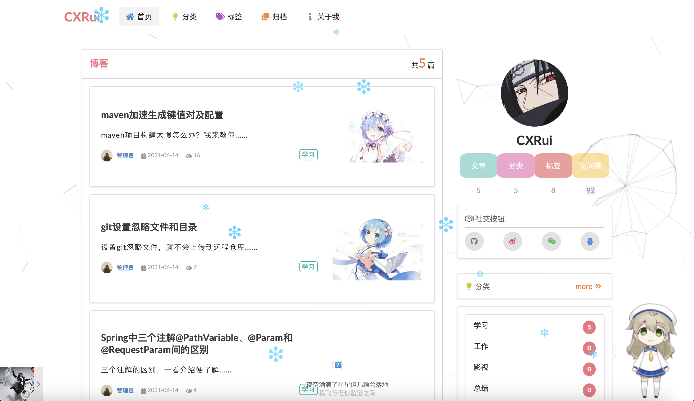
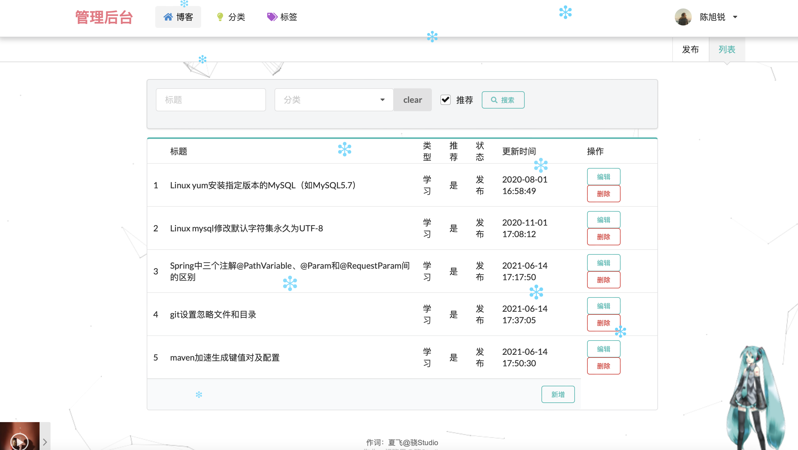

#  个人博客

## 介绍

> 博客主页（www.chenxurui.cn)（43.136.69.28）
>
> 前台进行博客展示【分类+标签】，后台进行数据管理【发表文章、管理分类、评论和标签】

## 效果图

>博客前台效果展示：
>
>
>
>博客后台展示：
>
>

## 软件架构

> 软件架构说明
>
> - **前端**：hymeleaf+Semantic UI
> - **后端**：spring boot+mybatis+mysql+lombok

## 安装教程

> 1. 本地用Idea的Spring Initializr方式创建一个名为blog项目，引入Spring Web依赖
> 2. 将clone内容复制到新建项目中
> 3. 通过idea的maven功能，自动下载获取Web开发所需的依赖jar包

## 使用说明

> 1. 需要mysql程序（作者版本5.7.18）
> 2. 数据库的设计在本项目中有附录文件blog.sql

## 参与贡献

1. 项目创建——chenxurui
2. 提交代码——chenxurui

